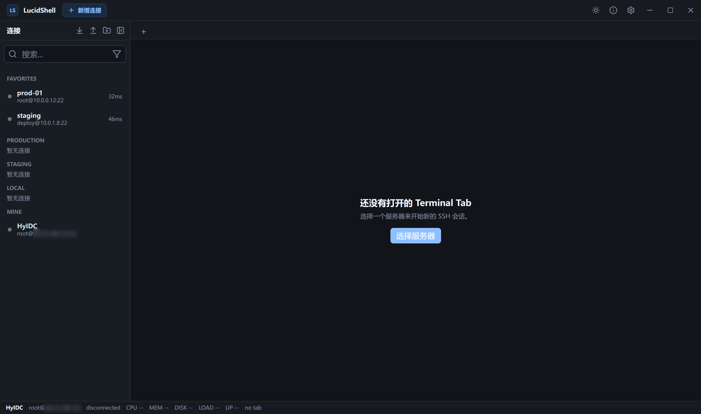
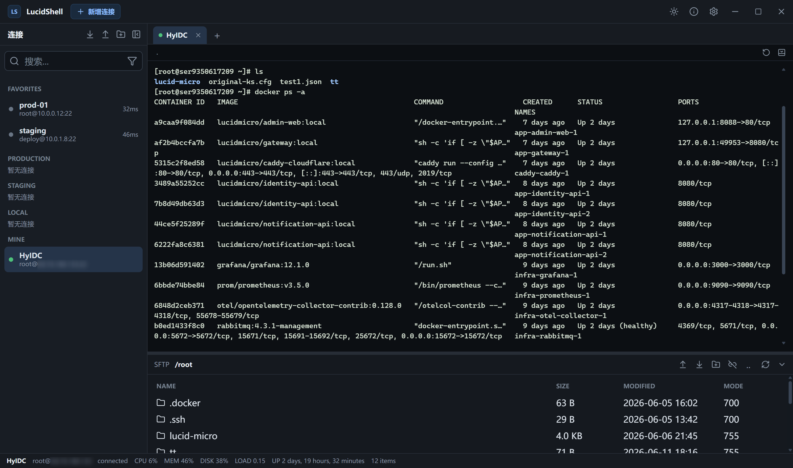
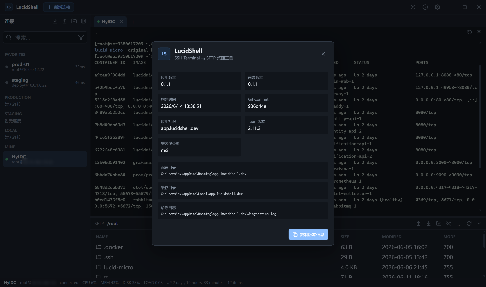
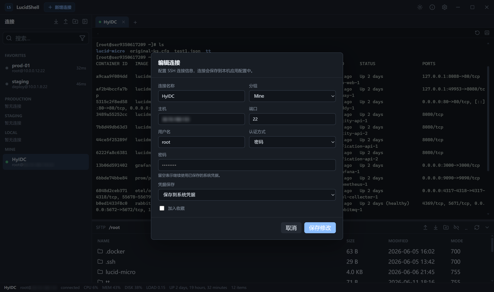

# LucidShell

LucidShell 是一个使用 Rust + Tauri + Vue 3 + TypeScript 构建的桌面 SSH/SFTP 工具。它把终端、SFTP、连接管理和基础服务器状态放在同一个工作区里，目标是提供一个简洁、稳定、适合日常运维和开发使用的跨平台客户端。

> 当前项目处于早期 Beta 阶段，核心 SSH/SFTP 流程已经可用，仍建议先在非关键环境中验证后再用于生产操作。

## 界面预览

| 主界面 | 多终端与 SFTP 分栏 |
| --- | --- |
|  |  |
| 连接配置 | 诊断面板 |
|  |  |

## 功能特性

- 多 Terminal Tab，支持新建、关闭、切换、重命名、重连和关闭其他 Tab。
- 每个 Terminal Tab 对应独立 SFTP 面板，支持显示/隐藏和分栏比例记忆。
- SFTP 支持目录浏览、上传、下载、批量上传、文件夹上传、递归文件夹下载、删除非空文件夹、重命名、新建文件夹。
- 支持本地编辑远端文件：下载到本地缓存、使用系统默认编辑器打开、保存后自动上传。
- 支持拖拽上传文件或文件夹到 SFTP 工作区。
- 支持 SFTP 跟随终端当前目录，可按设置默认开启，也可按需确认开启。
- 连接配置支持分组、导入、导出、本地持久化。
- 密码支持明文保存或系统凭据存储。
- 支持 known_hosts 主机指纹校验，并提供未知主机和指纹变更确认流程。
- Terminal 支持粘贴保护、bracketed paste、写入队列和分片发送。
- 连接生命周期管理：断开、重连、健康检查、空闲/休眠/网络切换后的状态同步。
- 诊断面板用于查看运行错误和连接问题。
- 自绘窗口栏、深浅主题切换、关于/版本信息入口。

## 技术栈

- 桌面框架：Tauri 2
- 后端：Rust、Tokio、russh、russh-sftp
- 前端：Vue 3、TypeScript、Pinia、Vite
- 终端：xterm.js
- UI 架构：Feature-Sliced Design

## 本地开发

### 环境要求

- Node.js
- Rust stable
- Tauri 2 开发环境

Windows 上还需要安装 Tauri 官方文档要求的 WebView2、Visual Studio Build Tools 等依赖。

### 安装依赖

```bash
npm install
```

### 启动开发模式

```bash
npm run tauri dev
```

### 前端构建

```bash
npm run build
```

### Rust 检查

```bash
cd src-tauri
cargo check
```

### 打包应用

```bash
npm run tauri build
```

构建产物默认位于：

```text
src-tauri/target/release/
src-tauri/target/release/bundle/
```

## 版本信息

项目版本以 `package.json` 为主。构建前会自动同步到：

- `src-tauri/tauri.conf.json`
- `src-tauri/Cargo.toml`
- `src/shared/config/buildInfo.ts`

因此通常只需要修改 `package.json` 里的 `version` 字段，然后执行构建命令即可。

## 项目文档

- [架构设计](docs/architecture-design.md)
- [界面设计](docs/ui-design.md)
- [Beta 测试清单](docs/beta-test-checklist.md)
- [已知问题](docs/known-issues.md)
- [0.1.0 发布说明](docs/release-notes-0.1.0.md)

## 当前状态

LucidShell 目前适合进入小范围 Beta 测试。建议重点验证：

- 不同 Linux 发行版和 shell 下的终端兼容性。
- 长时间 SSH 连接、休眠唤醒、网络切换后的恢复体验。
- 大文件和多文件 SFTP 上传下载。
- 系统凭据、known_hosts、导入导出配置在不同 Windows 环境下的表现。

## 免责声明

本项目仍在快速开发中。涉及远端文件删除、覆盖、批量上传下载等操作时，请先确认目标路径和备份策略。
